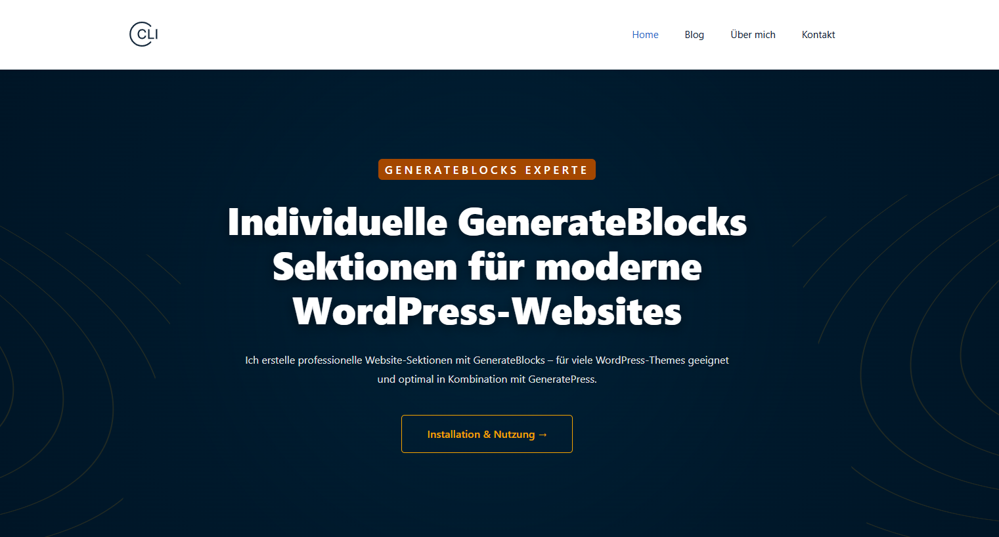

# gb-ai-code · GenerateBlocks Codex 3.2.0

Ein kopierfertiges Projektpaket, mit dem Codex aus Screenshots und deinen Vorgaben
bearbeitbare GenerateBlocks-Sektionen für WordPress erstellt. Enthalten sind
Projektregeln, spezialisierte Skills, 15 technische Referenzen, Prüfskripte,
eine ausführliche Beispiel-Anleitung und ein GeneratePress Child Theme.



*Beispielansicht der lokalen WordPress-Website mit GenerateBlocks.*

**Installation:** Den gesamten Paketinhalt direkt in den Hauptordner einer
bestehenden WordPress-Installation kopieren. Der Ordnername ist frei wählbar.
Es gibt keine fest eingebauten Benutzerpfade und keine zentrale Installation der
Skills. Für die normalen Python-Werkzeuge sind weder `pip install` noch npm nötig.

Das Paket ergänzt WordPress. Es installiert WordPress, die Datenbank und Plugins
nicht selbst. Kopieren aktiviert kein Theme und erzeugt keine Seiten automatisch.
Sind WordPress, GeneratePress und GenerateBlocks bereits eingerichtet, genügt das
Kopieren für die Codex-Projektdateien; anschließend das Child Theme bei Bedarf
aktivieren und den WordPress-Ordner in Codex öffnen.

## 1. Abhängigkeiten

| Bestandteil | Wann erforderlich? | Einrichtung / mitgeliefert? |
|---|---|---|
| WordPress mit Block-Editor | Für Website und Blockbearbeitung | Bestehende, funktionierende Installation; nicht enthalten. |
| Webserver, PHP, MySQL/MariaDB | Für WordPress | Unter Windows z. B. XAMPP mit laufendem Apache und Datenbankdienst. Nicht enthalten. |
| GeneratePress | Für das mitgelieferte Child Theme | Haupttheme separat installieren und installiert lassen. |
| GenerateBlocks | Für die nativen Blöcke | Plugin separat installieren und aktivieren. |
| GenerateBlocks Pro | Nur für verwendete Pro-Funktionen, etwa Tabs oder Karussells | Separat installieren und aktivieren; nicht enthalten. |
| GP Premium | Nur wenn die Website dessen Zusatzfunktionen verwendet | Für einfache Inhaltsblöcke und diese Anleitung nicht erforderlich; nicht enthalten. |
| GeneratePress Child 0.4 | Für die gemeinsamen Layout-/Typografie-Vorgaben des Pakets | Quellordner und installierbares Theme-ZIP enthalten. Eigene Theme-Anpassungen zusammenführen. |
| Codex mit lokalem Projektzugriff | Zum KI-gestützten Erstellen und Reparieren | Separat eingerichtet und angemeldet. Python-Prüfungen funktionieren auch ohne Codex. |
| Python 3.10 oder neuer | Für Einrichtungskontrolle, Validatoren, Export, ZIP-Build und Sync | Separat installieren; ausschließlich Standardbibliothek, keine zusätzlichen Python-Pakete. |
| PHP als Terminalbefehl `php` | Für die zusätzliche PHP-Syntaxprüfung | In XAMPP enthalten; bei Bedarf `C:\xampp\php` zum PATH hinzufügen. Ohne PHP CLI bleibt dieser Test offen. |
| Browser | Für Gutenberg, Frontend und responsive Prüfung | Für Editorprüfungen in WordPress anmelden. |
| Node.js, Playwright und Chromium/Chrome | Nur für `tools/check_typography.cjs` | Optionaler isolierter Browsertest; nicht für Installation oder Python-Prüfungen erforderlich. |
| Git und GitHub-Zugang | Nur für Entwicklung und Veröffentlichung | Nicht zum Kopieren/Benutzen erforderlich. |
| WP-CLI | Optional für administrative Arbeiten | Keine Voraussetzung der Paketwerkzeuge; nicht enthalten. |
| Weitere Form-/Medien-Plugins | Nur wenn eine verwendete Referenz diese benötigt | Etwa Contact Form 7 für ein entsprechendes Formular. Echte IDs aus der Zielinstallation einsetzen. |

WordPress empfiehlt derzeit PHP 8.3+, MariaDB 10.11+ oder MySQL 8.0+ und HTTPS
für veröffentlichte Websites. Das lokale Beispiel verwendet HTTP auf `localhost`.
Maßgeblich sind die Anforderungen deiner tatsächlichen WordPress-/Plugin-Versionen.
[Offizielle WordPress-Anforderungen](https://wordpress.org/about/requirements/)

Untersuchter Stand: **GeneratePress 3.6.1, GenerateBlocks 2.4.1,
GenerateBlocks Pro 2.7.1 und GP Premium 2.5.6**. Das sind Prüfstände,
keine Mindestversionen und keine Aufforderung zum Downgrade. Bei anderen
Versionen Quellen und betroffene Blöcke prüfen.
[GenerateBlocks und aktuelle Anforderungen](https://wordpress.org/plugins/generateblocks/)

## 2. Installation in XAMPP

1. Apache und MySQL/MariaDB im XAMPP Control Panel starten. Die WordPress-Seite
   muss bereits funktionieren, z. B. `http://localhost/nerdies2000/`.
2. WordPress-Dateien und Datenbank sichern. Eigene `AGENTS.md`, Skills,
   `.gitignore` und vorhandene Anpassungen in `generatepress_child` abgleichen.
3. Das Gesamtpaket `dist/generateblocks-codex-v3.2.0.zip` entpacken. Alternativ
   das GitHub-Repository herunterladen und dessen äußeren Ordner öffnen.
4. **Den Inhalt** direkt nach `C:\xampp\htdocs\nerdies2000\` kopieren, neben
   `wp-admin`, `wp-includes` und `wp-config.php`. `.agents` mitkopieren.
   Vorhandene eigene Dateien zusammenführen statt ungeprüft ersetzen.
5. Unter „Plugins“ GenerateBlocks und gegebenenfalls benötigte Pro-Plugins aktivieren.
6. Unter „Design → Themes“ das GeneratePress Child aktivieren, sofern du dessen
   Einstellungen verwenden möchtest. Das Haupttheme bleibt installiert.
7. Den WordPress-Hauptordner als Projekt in Codex öffnen. Bereit für den ersten Auftrag.

`nerdies2000` ist nur ein Beispiel. Derselbe Paketinhalt funktioniert etwa auch
in `C:\xampp\htdocs\meine-website\` oder einem WordPress-Ordner auf Linux.
Es wird kein PHP-Installer im Browser aufgerufen.

```text
C:\xampp\htdocs\nerdies2000\
├── AGENTS.md                       ← aus diesem Paket
├── README.md
├── START-HIER.cmd                  ← optionaler Windows-Einrichtungscheck
├── .agents\skills\                 ← Projekt-Skills für Codex
├── references\                    ← technische Referenzen
├── tools\                         ← lokale Python-Werkzeuge
├── docs\examples\                 ← native Beispiel-Anleitung
├── dist\                          ← Download-/Theme-ZIPs
├── wp-content\themes\generatepress_child\
├── wp-admin\                      ← vorhandenes WordPress
├── wp-includes\                    ← vorhandenes WordPress
└── wp-config.php                   ← eigene WordPress-Konfiguration
```

**Theme allein installieren:** Nur `dist/generatepress-child-v0.4.zip` unter
„Design → Themes → Hinzufügen → Theme hochladen“ verwenden. Das Gesamtpaket
gehört weder in die Plugin- noch in die Theme-Uploadmaske.

## 3. Einrichtung kontrollieren

Unter Windows optional `START-HIER.cmd` doppelklicken oder im WordPress-Ordner:

```powershell
python tools/setup_project.py
python tools/validate_all.py --installed
```

Die Werkzeuge bestimmen den Paketordner aus ihrem eigenen Speicherort und können
auch über einen absoluten Pfad von anderswo gestartet werden. Der Einrichtungscheck
ändert weder Dateien noch Datenbank. Er erkennt falsche Ordnerebenen und fehlende Quellen.
Standardmäßig sind GeneratePress und GenerateBlocks erforderlich; fehlende
Premium-Plugins werden als optional gemeldet. Für die vollständige Pro-Umgebung:

```powershell
python tools/validate_all.py --installed --profile full
```

Eine alleinstehende Paketkopie ohne WordPress prüfst du mit
`python tools/validate_all.py`. Versionsunterschiede zum Prüfstand gezielt
prüfen; Kontextwerte werden nicht automatisch geändert. Dateiprüfungen bestätigen
weder Plugin-Aktivierung noch Datenbankverbindung.

## 4. So funktioniert das Paket

1. Codex liest `AGENTS.md` und die projektspezifischen Regeln.
2. Ein passender Skill wählt die technische Referenz für die Blockfamilie.
3. Dein Screenshot bestimmt das Aussehen. Plugin-Quellen und Referenzen bestimmen
   Attribute und gültiges Gutenberg-Markup.
4. Codex erzeugt eine HTML-Datei mit vollständigen Blockkommentaren, Attributen,
   CSS, responsiven Einstellungen und editierbaren nativen Blöcken.
5. Validatoren kontrollieren unter anderem IDs, Struktur, gespeichertes Markup
   und die Übereinstimmung von `styles` und `css`.
6. Du übernimmst den Blockcode in WordPress, passt Inhalte an und prüfst das Ergebnis.

Die Projektanweisungen stehen in `AGENTS.md`, die Skills unter `.agents/skills`.
[Codex-Projektanweisungen](https://learn.chatgpt.com/docs/agent-configuration/agents-md),
[Codex-Anpassungen und Skills](https://learn.chatgpt.com/docs/customization/overview)

Erster Auftrag in einer neuen Codex-Aufgabe im WordPress-Ordner:

```text
Lies AGENTS.md und PROJECT-CONTEXT.md. Erkläre die Projektregeln,
nenne die verfügbaren GenerateBlocks-Skills und führe
python tools/setup_project.py aus. Verändere zunächst keine Seiten.
```

Danach Screenshot anhängen und beispielsweise schreiben:

```text
$generateblocks-visual-to-code
Erstelle aus meinem Screenshot eine native GenerateBlocks-Sektion.
Verwende meine Texte und echten Links. Beachte die Projektregeln.
Speichere den vollständigen Blockcode unter .local/meine-sektion.html
und prüfe ihn im strengen Modus. Liste offene Platzhalter und noch
ausstehende Browserprüfungen auf.
```

## 5. Blöcke in WordPress einsetzen

1. Vollständigen Inhalt der erzeugten HTML-Datei kopieren, einschließlich
   `<!-- wp:generateblocks/… -->` und der schließenden Kommentare.
2. Zielseite bearbeiten und über das Drei-Punkte-Menü zum **Code-Editor** wechseln.
   Bestehenden Inhalt vorher sichern.
3. Code zwischen vollständigen Blöcken einfügen. Nicht als „Individuelles HTML“ einsetzen.
4. Zur visuellen Ansicht wechseln. Blöcke über die Listenansicht auswählen und
   Texte, Abstände, Farben und Links mit GenerateBlocks bearbeiten.
5. Speichern, Editor neu öffnen und Frontend auf Desktop, Tablet und Smartphone
   prüfen. Ungültige Blöcke vor der Veröffentlichung reparieren.

Referenzen sind technische Vorlagen. Alte Beispiel-Links, Formular-/Medien-IDs
und Layoutwerte nicht ungeprüft auf die eigene Website übertragen.

### Mitgelieferte Installationsanleitung verwenden

Für die Beispiel-Anleitung mit passenden Download-Pfaden:

```powershell
python tools/export_homepage_guide.py --site-url http://localhost/nerdies2000/
python tools/validate_gb_block.py --strict .local/homepage-package-guide.html
```

Die tatsächliche Basis-URL einschließlich Unterordner und gegebenenfalls Port
angeben. Danach `.local/homepage-package-guide.html` wie oben einfügen.
Der Export schreibt keine WordPress-Seite und überschreibt keine vorhandene Datei;
für eine neue Variante `--output .local/anleitung-neu.html` angeben.
Die verlinkten ZIPs müssen im `dist`-Ordner der Zielinstallation vorhanden sein.
Die ursprüngliche Vorlage unter `docs/examples` enthält Download-Pfade für eine
Installation direkt an der Domain-Wurzel; für Unterordner den Export verwenden.

## Zusätzliche Plugin-Funktionen

Neue Arbeitsanleitungen decken Pro-Navigation/Mega Menus, native Formulare,
Overlays/Anzeigebedingungen, globale Klassen/Muster und GP Premium Elements ab.
Query-Anleitungen ergänzen Dynamic Tags, Pagination, Leerzustände und Repeater.
Quellbelege und Grenzen: [Plugin-Funktionen](PLUGIN-FEATURES.md).

```powershell
python tools/inspect_plugin_features.py
```

In einer Paketkopie ohne Plugins `--root C:/pfad/zur/wordpress-installation`
angeben. Pro Forms sind im untersuchten Quellcode standardmäßig ausgeschaltet.
Die Erweiterung aktiviert keine Module und ändert keine Website-Einstellungen.
Gutenberg-/Frontend-Tests bleiben für konkrete erzeugte Blöcke nötig.

## 6. Werkzeuge

| Befehl | Aufgabe |
|---|---|
| `python tools/setup_project.py` | Kopierziel und installierte Quellen kontrollieren. |
| `python tools/check_environment.py --profile full` | Alle dokumentierten Plugin-/Theme-Versionen vergleichen. |
| `python tools/validate_all.py` | Tests, Child Theme, Referenzen und Beispiel-Anleitung prüfen. |
| `python tools/validate_all.py --installed` | Zusätzlich die installierten Basis-Abhängigkeiten prüfen. |
| `python tools/validate_gb_block.py --strict .local/meine-sektion.html` | Export prüfen; Warnungen führen ebenfalls zu Exitcode 1. |
| `python tools/build_release.py` | Versioniertes ZIP und SHA-256-Datei aus `TREE.txt` bauen. |
| `python tools/sync_package.py --destination C:/paketkopie` | Mit einer zweiten Kopie vergleichen. |
| `python tools/sync_package.py --destination C:/paketkopie --apply` | Mit Konfliktprüfung und Sicherungen synchronisieren. |
| `node tools/check_typography.cjs` | Optionaler isolierter Typografie-Browsertest. |

Die Python-Werkzeuge benötigen kein Netzwerk. Codex verwendet seine eigene
Verbindung/Anmeldung. API-Schlüssel gehören nicht in das Paket. Statische
Prüfungen ersetzen keine Gutenberg- und Sichttests. Historische Referenzen
enthalten dokumentierte Warnungen; neue Exporte streng prüfen.

Der optionale Node-Test setzt das Modul `playwright` und Chromium voraus.
Bei vorhandenem Chrome kann `PLAYWRIGHT_CHROMIUM_EXECUTABLE` auf dessen
ausführbare Datei zeigen. Kein npm-Build der Website ist erforderlich.

## 7. Updates und zweite Paketkopie

Neue Paketdateien nach einem Backup mit eigenen Änderungen zusammenführen.
`TREE.txt` führt die verteilten Dateien auf. Neue Dateien dort ergänzen,
validieren und das Release neu bauen. ZIPs enthalten keine WordPress-Datenbank,
Plugins, Uploads, Zugangsdaten oder verschachtelten Gesamtpaket-ZIPs.

Der Sync hat kein fest eingebautes Ziel. Für wiederholte lokale Pflege kann
`.package-sync.local.json` im Paketordner angelegt werden:

```json
{"destination": "C:/paketkopie/gb-ai-code"}
```

Dann funktionieren `python tools/sync_package.py` und `--apply` ohne Pfadangaben.
Quelle ist standardmäßig der Paketordner; optional ist `source` einstellbar.
Relative Konfigurationspfade beziehen sich auf den Paketordner, explizite
CLI-Pfade auf das aktuelle Arbeitsverzeichnis. Lokale Konfiguration und Sync-Stand
werden weder verteilt noch in Git aufgenommen. Sicherungen liegen neben dem Ziel.
Nach Abbrüchen unterstützt `--recover` die Wiederherstellung. Kein Hintergrunddienst.
Details: [PACKAGE-SYNC.md](PACKAGE-SYNC.md).

## 8. GitHub und Release

Das Repository enthält das Projektpaket, keine WordPress-Installation.
Die `.gitignore` grenzt Git auf Paketdateien ein und schließt lokale Konfiguration,
Zugangsdaten, Uploads, Cache und `.local` aus. Vor Veröffentlichung die vorgemerkten
Dateien mit `git diff --cached` prüfen. Eine vorhandene `.gitignore` zusammenführen.

`python tools/build_release.py` erzeugt:

```text
dist/generateblocks-codex-v3.2.0.zip
dist/generateblocks-codex-v3.2.0.sha256
```

Prüfsumme: `Get-FileHash dist/generateblocks-codex-v3.2.0.zip -Algorithm SHA256`.
Das Release-ZIP ist für die Installation gedacht. Bei GitHubs „Code → Download ZIP“
nur den Inhalt des zusätzlichen äußeren Ordners in WordPress kopieren.
Der GitHub-Workflow prüft Paket und Release-Build unter Windows und Linux.
Premium-Plugins werden nicht mitveröffentlicht.

## 9. Häufige Probleme

| Meldung / Symptom | Lösung |
|---|---|
| Kein WordPress-Hauptordner | Paketinhalt direkt neben `wp-admin` kopieren. |
| Python nicht gefunden | Python 3.10+ installieren und PATH/App-Ausführungsalias prüfen; alternativ `py -3`. |
| Fehlende installierte Quelle | Theme/Plugin installieren; im Basisprofil sind Premium-Plugins optional. |
| Versionsabweichung | Tatsächliche Version prüfen, betroffene Blöcke testen, erst dann Kontext aktualisieren. |
| Haupttheme fehlt | GeneratePress installieren; nur das Child-Theme-ZIP im Theme-Upload verwenden. |
| Codex kennt Skills nicht | WordPress-Hauptordner öffnen, `.agents/skills` mitkopieren, neue Aufgabe starten. |
| Block ungültig | Vollständigen Export inklusive Kommentare verwenden; Plugin-Version prüfen. |
| Download zeigt 404 | Guide mit richtiger `--site-url` erzeugen; ZIPs müssen unter `dist` liegen. |
| Kein Sync-Ziel | `--destination` oder lokale Konfiguration verwenden. |
| Zieldatei unabhängig geändert | Änderungen zusammenführen; Konfliktschutz nicht durch Löschen des Sync-Stands umgehen. |

Weiterführend: [Projektkontext](PROJECT-CONTEXT.md), [Regeln](PROJECT-RULES.md),
[Referenzübersicht](EXAMPLE-INDEX.md), [Prüfgrenzen](VALIDATION.md),
[Änderungsverlauf](CHANGELOG.md).


## 10. Welche Dateien gehören zum Paket?

| Bereich | Zweck |
|---|---|
| `README.md`, `START-HIER.cmd` | Einstieg, Einrichtung und Nutzung. |
| `AGENTS.md`, `PROJECT-RULES.md`, `PROJECT-CONTEXT.md` | Aktive Projektanweisungen und untersuchter Versionsstand. |
| `GenerateBlocks-Master-Formula-v2.md`, `EXAMPLE-INDEX.md`, `CAPABILITIES.md` | Technische Arbeitsweise, Referenzauswahl und unterstützte Blockfamilien. |
| `.agents/skills/`, `references/` | Benötigte Skills und technische Blockvorlagen. |
| `tools/`, `VALIDATION.md` | Prüfungen, Tests, Export und Paketbau. Tests bleiben enthalten, weil die gemeinsame Prüfroutine sie ausführt. |
| `PACKAGE-SYNC.md`, `TREE.txt` | Pflege zweier Kopien und explizites Dateiinventar. |
| `wp-content/themes/generatepress_child/` | Aktuelle Theme-Quelldateien. |
| `docs/examples/` | Anleitung als native Blöcke, Prüfbericht und README-Screenshot. |
| `dist/` | Aktuelles Gesamtpaket mit Prüfsumme und aktuelles Child-Theme-ZIP. |
| `.github/`, `.gitignore`, `.gitattributes` | Automatische GitHub-Prüfungen und verlässliche Versionierung. |
| `CHANGELOG.md` | Kurzer gemeinsamer Änderungsverlauf; für die Ausführung nicht erforderlich. |

Historische Einzel-Changelogs, alte Theme-ZIPs, archivierte Ausgangsprompts und
doppelte Installationsanleitungen gehören nicht in das aktuelle Paket.
Für frühere Stände steht die Git-Historie zur Verfügung. Lokale Arbeitspläne
bei Bedarf unter `.local/` ablegen; sie werden nicht veröffentlicht.
